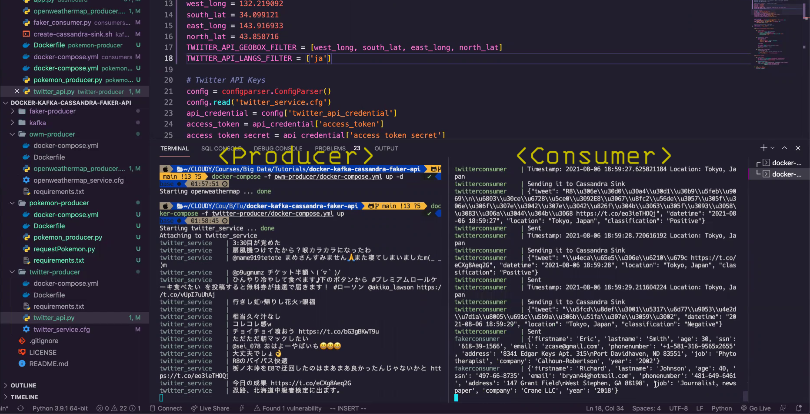

# Data Pipeline with Docker

#### Table of Contents
* [About](#about)
* [Data pipeline](#pipeline)
* [How to replicate the project](#run)
* [Demo video](#video)

# About
This project is the first assignment from Big Data for Engineering class. It utilizes Docker to deploy an end-to-end data pipeline on your local computer using containerized Kafka for data streaming, Cassandra for NoSQL database with Jupyter Lab and Dash framework for data analysis Visualization. There are 3 pipelines using data from Twitter and OpenWeatherMap 
APIs, Faker API and PokeAPI.

# Data pipeline

Kafka Producers and Consumers help stream data:

Data is stored in Cassandra Database:

# How to replicate the project

# Demo video
https://youtu.be/7Qf5LH3mwek

The project is under folder `assignment-1-project`

#### Create docker networks
<code>docker network create kafka-network
docker network create cassandra-network</code>

#### Start up Cassandra
<code>docker-compose -f cassandra/docker-compose.yml up -d --build</code>

#### Start up Kafka
<code>docker-compose -f kafka/docker-compose.yml up -d</code>

#### Start up the producers
- **OpenWeatherMap**: <code>docker-compose -f owm-producer/docker-compose.yml up -d --build</code>
- **Twitter Producer**: <code>docker-compose -f twitter-producer/docker-compose.yml up --build</code>
- **FakerAPI**: <code>docker-compose -f faker-producer/docker-compose.yml up -d --build</code>
- **Pokemon Producer** <code>docker-compose -f pokemon-producer/docker-compose.yml up -d --build</code>

#### Start all 4 consumers
<code>docker-compose -f consumers/docker-compose.yml up --build</code>

#### Check data in Cassandra DB
- Log in to Cassandra CLI: <code>docker exec -it cassandra bash</code>
- Query the data from 4 tables:
<code>$ cqlsh --cqlversion=3.4.4 127.0.0.1 #make sure you use the correct cqlversion
cqlsh> use kafkapipeline; #keyspace name
cqlsh:kafkapipeline> select * from twitterdata;
cqlsh:kafkapipeline> select * from weatherreport;
cqlsh:kafkapipeline> select * from fakerdata;</code>

#### Data visualization
- With Jupyter Notebook: <code>docker-compose -f data-vis/docker-compose.yml up -d --build</code>
- With Dash: <code>docker-compose -f dashboard/docker-compose.yml up -d</code>